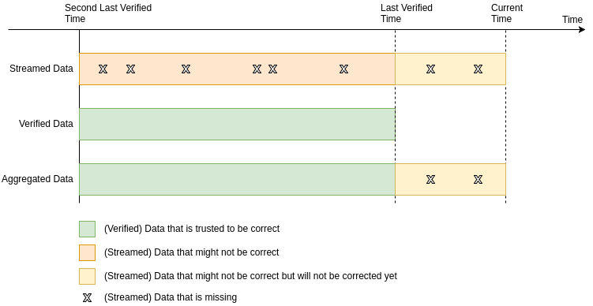
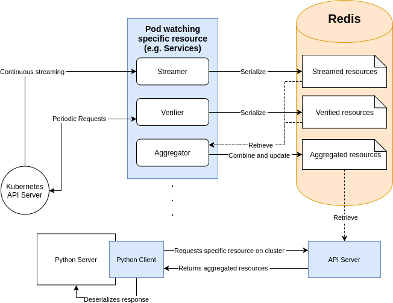
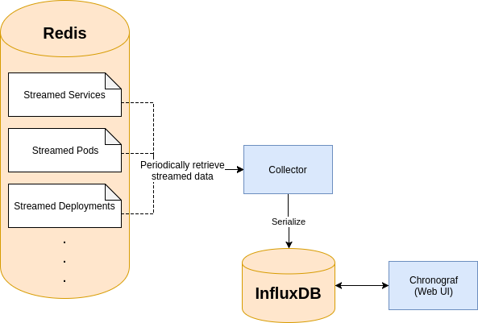

# Kubernetes Resource Monitor

An application used to cache the state of existing resources on a Kubernetes cluster. This provides an alternative to making repeated requests directly to the Kubernetes API server.

The caching mechanism aims to provide the following:
1. Reduce the load of requests going to the API server
2. Fast and sufficiently accurate responses to requests regarding the state of the cluster.

## Resource Monitoring

### Streaming

The Kubernetes Python client provides streaming capabilities that watches and receives events from the cluster based on changes to certain resources (Only a single api resource can be watched can be watched at a time, e.g. Pods, Services, Deployments, etc).

The benefits that the stream provides is that only a single connection is made to the API server, which means a significant reduction in the request load going to it. However, the drawbacks of this is that it is not always reliable as some events might be missed and never received from the stream.

Regardless, the resource monitor makes use of streaming to provide close to real-time updates to the cluster status. Events received are appended onto an existing dataframe stored in a remote redis server.

### Verification

To solve the issue of missing events, a verification mechanism is implemented by periodically requesting the actual state of the resources from the API server. This provides us with the correct states that the resources should actually be in, which are then stored and converted into a dataframe, replacing any previous existing dataframe in redis.

However, since we do not want to overload the API server, requests are only made periodically which means that we will not be able to receive the most updated versions (like from the stream).

### Aggregation

With two sources of data:
1. Streamed data - Most recent but unreliable
2. Verified data - Reliable but outdated

We perform an aggregation of both sets of data to produce a new aggregated set of data that is reliable up to the **last verified time**, while providing unreliable but updated data from that time onwards.

### Architecture

The above outlines the architecture of the caching system until it is received by the user. For every watched resource, a single pod with 3 containers (streamer, verified, aggregator) is deployed to carry out the aforementioned process of retrieving the cluster state.  

**Current resources available to be watched:**
1. Pods
2. Deployments
3. Persistent Volume Claims
4. Services
5. Ingress
6. Nodes

#### API and Python Client

An API server listens for GET requests for the resources and sends the requested data over. As we have our own implementations of serialization and available APIs, a python client is provided ([Kubernetes Resource Monitor](https://pypi.org/project/kubernetes-resource-monitor/)) to be used in your python application. This client provides methods to query the KRM API server and deserializes our custom objects into Kubernetes objects.

## Metrics - Stream Delay

This system also includes a separate metrics gathering implementation that monitors the delay from which an object is modified by the cluster to the time it is received by the stream. This only applies to `ADDED` and `DELETED` events which are respectively compared to their `creationTimestamp`(s) and `deletionTimestamp`(s).

A separate program periodically collects streamed data across all watched resources, serializes and then stores it into a time series database (InfluxDB). This data is viewable through a Chronograf Web UI that is connected to InfluxDB which provides an interface to perform custom queries on the existing data.
